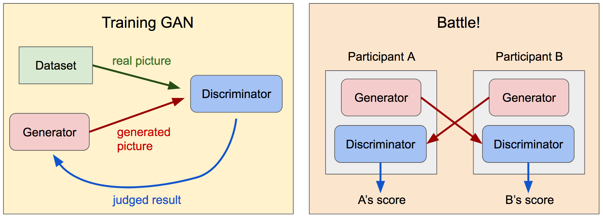
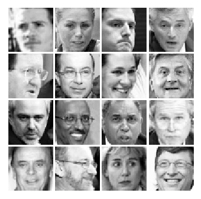
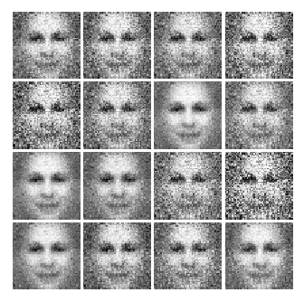
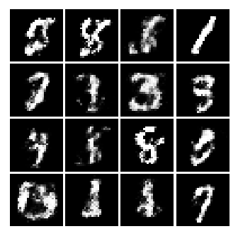

Table of Contents
=================

   * [Table of Contents](#table-of-contents)
   * [Generative Adversarial Networks](#generative-adversarial-networks)
      * [Objectives](#objectives)
         * [Battle Rules](#battle-rules)
      * [Input Data Format](#input-data-format)
      * [What you need to do](#what-you-need-to-do)
      * [Spec](#spec)
      * [Running Code in Google Cloud](#running-code-in-google-cloud)
         * [Training in Cloud](#training-in-cloud)
         * [Evaluating the Model in Cloud](#evaluating-the-model-in-cloud)
      * [Running Code Locally](#running-code-locally)
         * [Training Locally](#training-locally)
         * [Evaluation Using Validation](#evaluation-using-validation)
         * [Training Locally with MNIST](#training-locally-with-mnist)
      * [Submission](#submission)
 
# Generative Adversarial Networks
본 문제는 [GAN (Generative Adversarial Networks)](https://arxiv.org/abs/1701.00160)을 훈련시켜 보는 문제입니다.
GAN은 Generator과 Discriminator 두 개의 네트워크로 구성되어 있습니다. 여러분은 주어진 사람 얼굴 데이터를 사용하여 두 네트워크를 훈련하시면 됩니다.

- Generator : 주어진 데이터셋에 기반하여 사람 얼굴과 비슷한 그림 파일을 생성하는 네트워크.
- Discriminator : 이미지가 Generator에서 생성된 이미지인지 데이터셋에서 나온 진짜 사진인지를 판단하는 네트워크.

훈련이 모두 종료된 후, 여러분은 여러분의 모델을 가지고 다른 참가자들의 모델과 경합을 벌일 예정입니다!

## Objectives
대략적인 흐름은 다음과 같습니다:

- Training phase : 주어진 스켈레톤 코드와, 필요하다면 Google Cloud Platform을 이용하여 여러분만의 Generator / Discriminator를 훈련하는 단계.
- Battle phase : 제출된 모델들은 대회 시스템의 규칙에 따라 모델간 경쟁을 벌이며 이를 확인하는 단계.

### Battle Rules
단판승제 토너먼트 대회를 진행할 계획입니다. 각각의 경기는 Google Cloud에 제출된 모델들을 선수로 하여 운영팀에 의하여 진행되며 과정 및 결과는 전방의 스크린을 통해 함께 지켜보실 수 있습니다.

Let's say team A and team B battle each other.
팀 A와 팀 B가 경기를 한다고 할 때, 과정은 다음과 같습니다:
1. A의 Generator은 15개의 이미지를 생성하고, 또한 15개의 실제 이미지를 테스트 데이터셋에서 가져옵니다.
2. B의 Discriminator은 A가 제공한 이미지를 입력받은 뒤 추측을 내놓습니다.
3. B의 추측과 사실을 비교하여 맞은 숫자가 B의 점수가 됩니다.
4. 이 후, A와 B의 역할을 바꾸어 B의 Generator과 A의 Discriminator가 1 ~ 3단계를 다시 진행합니다.
5. A의 점수와 B의 점수를 비교하여 경기의 승자를 정합니다.
6. 1 ~ 5까지의 과정을 한 라운드라고 합니다. 준결승전까지는 각 경기는 한 라운드로 구성되며, 결승전은 3라운드로 진행됩니다.
7. 모든 경기가 끝난 후 점수에 따라 승자를 정합니다. 동점의 경우, Generator / Discriminator 실행에 걸린 시간의 합이 적은 쪽이 승리합니다.


## Input Data Format
모든 이미지는 [labeled faces in the wild](http://vis-www.cs.umass.edu/lfw/) 데이터셋에서 가져왔습니다. 각 이미지는 50x50 사이즈로 다운샘플링 및 흑백으로 처리되어 있습니다. 예를 들자면:




데이터는 다음 주소에서 접근 가능합니다:
- Training data: gs://kmlc_test_train_bucket/gan/train.tfrecords (11901 images)
- Validation data: gs://kmlc_test_train_bucket/gan/validation.tfrecords (689 images)

훈련은 Google Cloud에서 하는 것을 추천해드리나, 평가 데이터는 충분히 작기 때문에 로컬에서도 돌리실 수 있을 것이라 예상합니다.

다음 명령어를 통해서 다운받으실 수 있습니다:
```
gsutil cp -r gs://kmlc_test_train_bucket/gan/train.tfrecords ./
gsutil cp -r gs://kmlc_test_train_bucket/gan/validation.tfrecords ./
```

훈련 데이터 및 교차평가 데이터는 같은 형식으로 저장되어 있으며, 각각의 레코드는 한 피쳐만을 가지고 있습니다:
- image_raw: int64 리스트 피쳐로, 각 픽셀의 값(0 - 255)를 띄고 있습니다. 본 리스트는 50x50 이미지를 1차원으로 펼친 값입니다.

테스트 데이터(624개 이미지)는 제공되지 않으며, 이는 추후 경기에 이용될 예정입니다.

또한, 튜토리얼을 위해 제공해 드렸던 [MNIST tutorial](https://github.com/machine-learning-challenge/tutorial_mnist/tree/master/mnist) 및 데이터가 아직 유효합니다. 본 소스 코드는 MNIST 데이터상에서 훈련을 지원하며, 필요하시다면 이를 통해 모델 훈련 및 평가에 도움을 받으실 수도 있습니다. 좀 더 자세한 내용은 [Training Locally with MNIST](#training-locally-with-mnist) 를 참고해주세요.
```
gsutil cp -r gs://kmlc_test_train_bucket/mnist ./
```

## What you need to do
* 본 저장소는 GAN의 기본적인 구조를 구현한 뼈대 코드를 제공합니다. 만약 본 저장소의 train.py를 그대로 실행하신다면 다음과 같은 이미지를 생성하실 수 있습니다(좀 무서워요...) :



* 여러분은 본 코드를 수정하셔서 모델의 성능을 향상시키셔야 합니다.
* *models.py*에서 BaseModel을 상속하여 여러분의 (generator, discriminator)을 만드세요. 원하시면 BaseModel역시 수정하셔도 됩니다.
* *losses.py*에서 BaseLoss를 상속하여 여러분의 모델에 잘 맞는 로스 함수 calculate_loss를 만들어주세요.
* 필요하다면 *train.py*에서 훈련 로직을 변경해주세요.
* *중요* - 만약 데이터를 전처리/리사이징하시려면 *readers.py*가 아닌 *models.py*안에서 해 주시기 바랍니다. 운영측은 체크포인트 파일에 의거하여 여러분의 모델을 실행하게 되며, 입력 텐서 및 출력 텐서의 형태는 아래 Spec과 같아야 합니다.

## Spec
* 경기에서 운영측은 Google Cloud 버킷에 저장된 체크포인트 파일(tf.train.Saver에 의하여 저장됨)으로부터 참가자의 훈련된 모델을 사용합니다. 각 팀은 제출을 위한 고유한 버킷을 배정받게 됩니다. 자세한 내용은 [Submission](#submission)을 참고해주세요.
  * 모델을 저장하기 위한 로직은 뼈대 코드에 이미 구현되어 있으니 걱정하지 마세요!
* 다양한 이미지를 생성하기 위해 Generator 모델은 랜덤한 노이즈 신호를 입력으로 받게 됩니다("latent vector"라고도 부릅니다).
  * 일관성을 위하여 Generator 모델의 입력으로는 *random_noise_generator.py* 가 쓰이게 됩니다.
  * 이는 [-1, 1] 안에서 고른 분포로 생성되는 랜덤한 실수 100개를 담고 있습니다.
* Generator과 Discriminator은 같은 체크포인트 파일 안에 있어야 합니다. 체크포인트 파일 내의 기본 그래프는 다음의 모든 텐서를 tf.add_to_collection()을 통해서 추가되는 collection으로, 올바른 이름과 함께 포함하고 있어야 합니다:
  * **"noise_input_placeholder"** : *[None, 100]* shape의 placeholder tensor로, generator에 noise input (latent vector)를 입력할 때 사용합니다. 여기엔 항상 random_noise_generator.py가 사용될 것입니다.
  * **"generated_images"** : *[None, 2500]* shape의 tensor로 generator에서 나온 결과인 50x50 이미지를 1차원으로 펼친 형태로 갖고 있습니다. 각 픽셀은 [0, 1] 사이의 float 값으로, 0은 검은색 1은 흰색입니다.
  * **"input_batch_raw"** : [*None, 2500]* shape의 placeholder tensor로, discriminator에 이미지를 입력할 때 사용합니다. 50x50 이미지의 정보를 1차원으로 펼친 형태로 입력하며, 각 픽셀은 [0, 1] 사이의 float 값을 가지고 0은 검은색 1은 흰색 입니다.
  * **"p_for_data"** : *[None, 1]* shape의 float tensor로, discriminator의 "input_batch_raw" 입력에 대한 결과값을 출력합니다. 각 예측값은 [0, 1] 사이의 확률로 나타내어지며, 0은 해당 이미지를 가짜라고 예측한 것이고 1은 해당 이미지를 진짜라고 예측한 것입니다. 실제로 판정할 때는 값이 0.5보다 큰지 작은지에 따라 판단합니다.
  * 주어진 뼈대 코드는 이미 위 Spec을 만족시키고 있습니다.
* 본 행사의 참가자들은 GAN 구조에 기반하여 모델을 훈련하고 그 안에서 경기를 위한 강한 모델을 생성하여 해당 모델로 하여금 경기에 참여해주시기를 기대하고 있습니다. 따라서 GAN 구조가 아닌 방법의 훈련은 금지하고 있습니다. 예를 들면 다음과 같은 행동은 금지됩니다:
  * 훈련 데이터의 이미지를 기억하여 그대로 출력하거나 이에 준하는 행위.
  * GAN 구조에 의한 훈련이 아닌 방법으로, Generator을 사용하지 않고 Discriminator을 생성하는 행위 등.
* 또한 주어진 데이터셋이 아닌 외부 데이터를 사용하는 것은 금지됩니다.

## Running Code in Google Cloud
훈련 데이터의 크기를 고려하면, 훈련은 Google Cloud를 사용하여 진행하시기를 추천해드립니다. --generator_model과 --discriminator_model을 여러분의 모델 이름으로 변경하고 경로 역시 알맞게 변경해주세요.

모든 gcloud 명령어는 저장소 루트에서 실행되어야 합니다. 

### Training in Cloud
```
BUCKET_NAME=gs://${USER}_kmlc_gan_train_bucket
# (One Time) Create a storage bucket to store training logs and checkpoints.
gsutil mb -l us-east1 $BUCKET_NAME
# Submit the training job.
JOB_NAME=kmlc_gan_train_$(date +%Y%m%d_%H%M%S); gcloud --verbosity=debug ml-engine jobs \
submit training $JOB_NAME \
--package-path=gan --module-name=gan.train \
--staging-bucket=$BUCKET_NAME --region=us-east1 \
--config=gan/cloudml-gpu.yaml \
-- --train_data_pattern='gs://kmlc_test_train_bucket/gan/train.tfrecords' \
--generator_model=SampleGenerator --discriminator_model=SampleDiscriminator \
--train_dir=$BUCKET_NAME/kmlc_gan_train --num_epochs=50 --start_new_model
```

또한 tensorboard를 통해 퍼포먼스를 시각화하여 보실 수 있습니다. train.py의 --export_model_steps 플래그를 변경하여 모델 저장 기간 및 tensorboard에 기록을 남기는 기간을 조절할 수 있습니다.
```
tensorboard --logdir=$BUCKET_NAME/kmlc_gan_train --port=8080
```

### Evaluating the Model in Cloud
```
JOB_TO_EVAL=kmlc_gan_train
JOB_NAME=kmlc_gan_eval_$(date +%Y%m%d_%H%M%S); gcloud --verbosity=debug ml-engine jobs \
submit training $JOB_NAME \
--package-path=gan --module-name=gan.eval \
--staging-bucket=$BUCKET_NAME --region=us-east1 \
--config=gan/cloudml-gpu.yaml \
-- --eval_data_pattern='gs://kmlc_test_train_bucket/gan/validation.tfrecords' \
--generator_model=SampleGenerator --discriminator_model=SampleDiscriminator \
--train_dir=$BUCKET_NAME/${JOB_TO_EVAL} --run_once=True
```

## Running Code Locally

모델을 개발하시던 중 작은 문제들을 해결하기 위해서 Cloud에 제출하지 않고 로컬에서 빠르게 테스트해볼 수 있습니다.

모든 gloucd 명령어는 저장소 루트에서 실행되어야 합니다. 
### Training Locally
```
gcloud ml-engine local train --package-path=gan --module-name=gan.train -- \
--train_data_pattern='TRAINING_DATA_FILE' \
--generator_model=SampleGenerator --discriminator_model=SampleDiscriminator \
--train_dir=/tmp/kmlc_gan_train --num_epochs=50 --start_new_model
```

### Evaluation Using Validation
교차검증 데이터를 이용하여 여러분의 모델을 평가해볼 수 있습니다.
```
gcloud ml-engine local train --package-path=gan --module-name=gan.eval -- \
--eval_data_pattern='VALIDATION_DATA_FILE' \
--generator_model=SampleGenerator --discriminator_model=SampleDiscriminator \
--train_dir=/tmp/kmlc_gan_train --run_once
```

### Training Locally with MNIST
여러분은 MNIST 데이터를 이용하여 여러분의 모델이 훈련 로직이 잘 동작하는지를 간단하게 살펴볼 수 있습니다.
--use_mnist=True 플래그를 설정하면 reader가 알맞게 변경되며, --export_generated_images=True 플래그를 설정할 시 생성된 이미지의 예시를 png 파일의 형태로 'out/' 디렉토리에 저장됩니다.([matplotlib](https://matplotlib.org)가 필요합니다.)

```
python train.py --train_data_pattern='MNIST_TRAINING_DATA_FILE' \
--train_dir=/tmp/kmlc_gan_train_mnist --export_generated_images=True --use_mnist=True \
--generator_model=SampleGenerator --discriminator_model=SampleDiscriminator --start_new_model 
```
다음은 주어진 뼈대코드를 그대로 이용하여 MNIST를 생성해본 결과입니다:




## Submission
각 팀마다 제출을 위한 고유한 Google Cloud 버킷이 제공될 예정입니다. 리스트는 [여기](https://docs.google.com/spreadsheets/d/1sRVB1kD_OzyOFaN4oJDW-UiS4JDF7u6_tWiZt2Xvecw/edit?usp=sharing)에서 볼 수 있습니다. Admin 권한을 얻기 위해 꼭 [Form](https://goo.gl/Y4njto)을 작성해 주세요. 
  * 여러분은 훈련된 모델을 포함한 체크포인트 파일들을 "gsutil cp" 명령어를 사용하여 **"gs://[BUCKET NAME]/model"** 디렉토리로 옮겨야 합니다. 혹은 해당 경로에서 직접 모델들을 훈련하셔도 됩니다.
  * 또한 여러분은 전 소스코드를 "gsutil cp"명령어를 사용하여 **"gs://[BUCKET NAME]/source"** 디렉토리에 제출하셔야 합니다.

여러분의 제출이 유효한지, 체크포인트 파일이 [Spec](#spec)을 만족하는지를 확인하기 위해서 --G_train_dir과 --D_train_dir을 여러분 팀의 버킷 주소로 설정한 뒤 *generate_and_discriminate.py* 스크립트를 실행해보시기 바랍니다. 예시는 다음과 같습니다:

```
BUCKET_NAME=gs://[TEAM BUCKET ADDRESS]
JOB_NAME=kmlc_gan_check_submission_$(date +%Y%m%d_%H%M%S); gcloud --verbosity=debug ml-engine jobs \
submit training $JOB_NAME \
--package-path=gan --module-name=gan.generate_and_discriminate \
--staging-bucket=$BUCKET_NAME --region=us-east1 \
--config=gan/cloudml-gpu.yaml \
-- --G_train_dir=$BUCKET_NAME/model --D_train_dir=$BUCKET_NAME/model \
--input_data_pattern='gs://kmlc_test_train_bucket/gan/validation.tfrecords' \
--num_generate=50 --output_dir=[BUCKET of yours]/results/
```
위 명령은 결과(images, ground_truth.csv, predictions.csv)를 버킷 내 results/ 디렉토리에 저장합니다. 만약 별다른 에러 없이 해당 출력 파일들을 볼 수 있다면 여러분의 제출은 유효합니다.
본 경기는 매뉴얼이 아닌 스크립트로 진행됨으로, 여러분의 모델이 경기에 정상적으로 참여할 수 있도록 꼭 확인해주세요!

### Mock Battle
Training phase 중간중간에 희망하는 팀들을 대상으로 모의전을 치룰 예정입니다.
작업중인 혹은 시험해 보고 싶은 모델 체크포인트 파일들을 미리 "gs://[BUCKET NAME]/model" 위치에 옮겨 놓으시면 랜덤으로 상대를 정해서 본 룰 대로 대결을 진행하고 결과를 알려 드리겠습니다. 12:00에 첫 모의전이 진행되며 이후 2시간마다 한번씩 또 진행됩니다.
